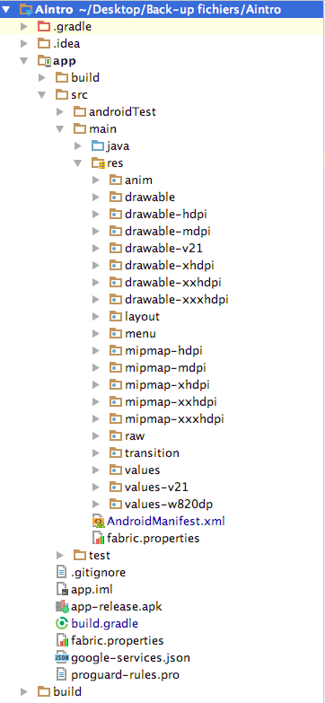
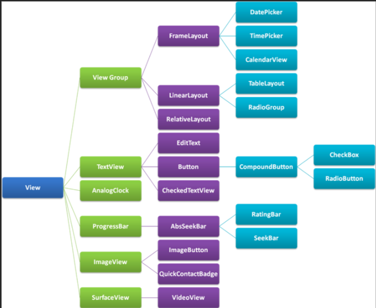
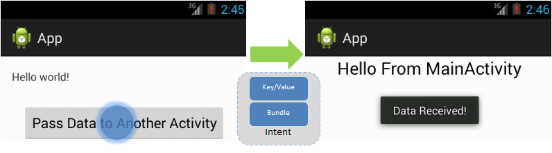
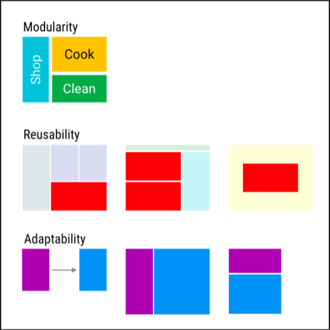
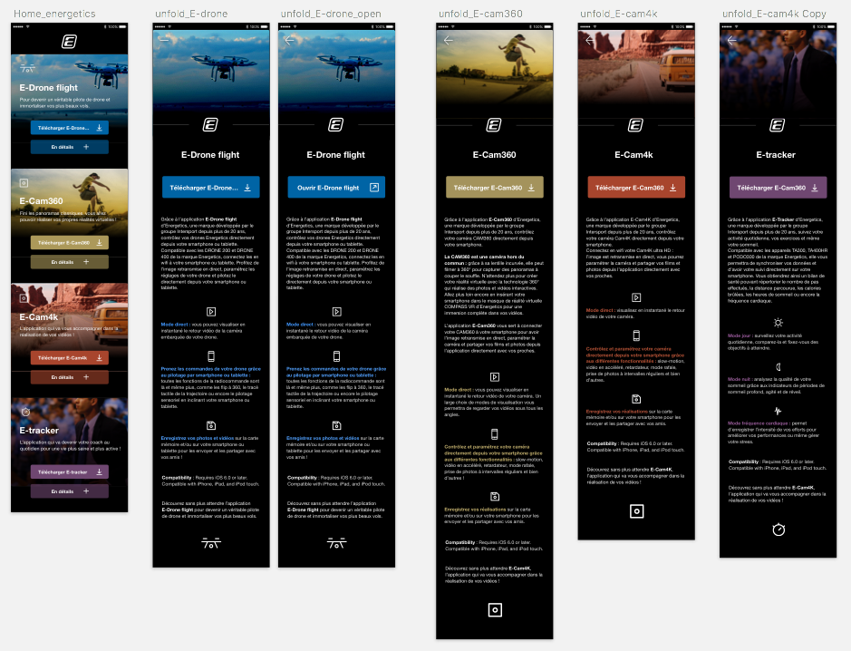

# Présentation du stage pour l'obtention du titre de Développeur Logiciel / Web
## Quentin DEBOVE
### CEFIM, Session 2016-2017

---

# Au programme 
### I. Introduction
### II. Environnement de travail
### III. Android
### IV. Premier projet : Energetics
### V. Second projet : refactorisation d'Aintro
### VI. Conclusion
### VII. Questions ?

---

# I. Introduction

### Milieu paramédical : réorientation
### Ambiance unique

---

# II. Environnement de travail

+++

## Le mame


+++

##NOWLY

+++

|Manysinn Thin                                                                                                                       |Jérome Heissler                                                                        |Mathieu Bolard                                                                          |
|------------------------------------------------------------------------------------------------------------------------------------|---------------------------------------------------------------------------------------|----------------------------------------------------------------------------------------|
|||| 

+++

## Les projets / prestations de NOWLY

+++

### Projets :
|                        |                                                                                                                       |
|------------------------|-----------------------------------------------------------------------------------------------------------------------|
|Nowly                   | "papa" d'Aintro                                                                                                       |
|Aintro                  ||
|et d'autres             | Files, Senseï...                                                                                                      |

+++

### Prestation :

| Satable | |
|---------|-----------------------------------------------------------------------------------------------------|

+++?image=https://upload.wikimedia.org/wikipedia/commons/thumb/9/93/Fibonacci_spiral_34.svg/2000px-Fibonacci_spiral_34.svg.png

## Les outils de travail

* Bitbucket
* Jira + suite Fibonnaci
* Slack

---

# III. Apprentissage d'Android

+++

## Présentation d'Android

* Système exploitation mobile basé sur noyau Linux.
* Développé par Google, lancé en 2007.
* 80% parts de marché dans le monde.

+++

## Versionning

* Noms de desserts et progression alphabétique


+++

## Java et Android

* V4.4 et inférieur : Dalvik
* Au delà : ART (Android RunTime)

+++

## Création d'un projet

* Deux fichiers importants : Gradle et Manifest
* Version de l'API importante !

+++


 
+++

## Vue, activité et fragment

+++

### Vue

* Vue : base des composants pour intéraction et l'interactivité. Placées dans des layout (xml).
* Exemple de vue : Button, TextView...


+++

### Activité

* Activité ~ une page et extends du Context.


+++

### Fragment

* Fragment : partie de l'écran.
* Destiné à être remplacé ou détruit.
* Constructeur par défaut uniquement.


+++

## La principale difficulté rencontrée

### Cycle de vie 

|Activité                                                                                                                                |Fragment                                                                    |
|----------------------------------------------------------------------------------------------------------------------------------------|----------------------------------------------------------------------------------------------------------------------------------------|
|||

---

# IV. Premier projet : Energetics


+++

## Présentation

* Marque exclusive Intersport.
* Souhaite une application tampon "vitrine".

+++

## Apercu charte graphique (non validée)



+++

## Les grandes lignes du code

* Création de 2 RecycleView.
* Une classe Article.
* Un Singleton.

+++

## Les bonus

* Librairie Picasso
```java
Picasso.with(context).load("http://i.imgur.com/DvpvklR.png").into(imageView);
```
* L'effet de parallaxe : SensorManager.
* Bounce sur RecycleView.

+++

## Conclusion du projet

* Intégration difficile.
* Problème de mémoire.
* UX important.

---

