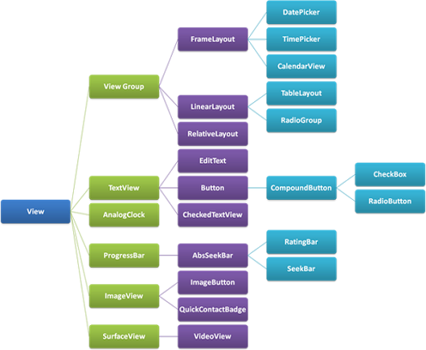
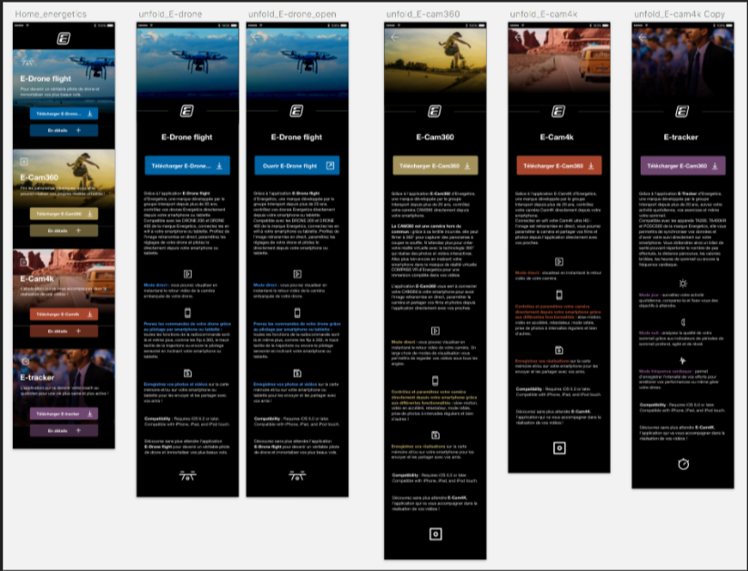
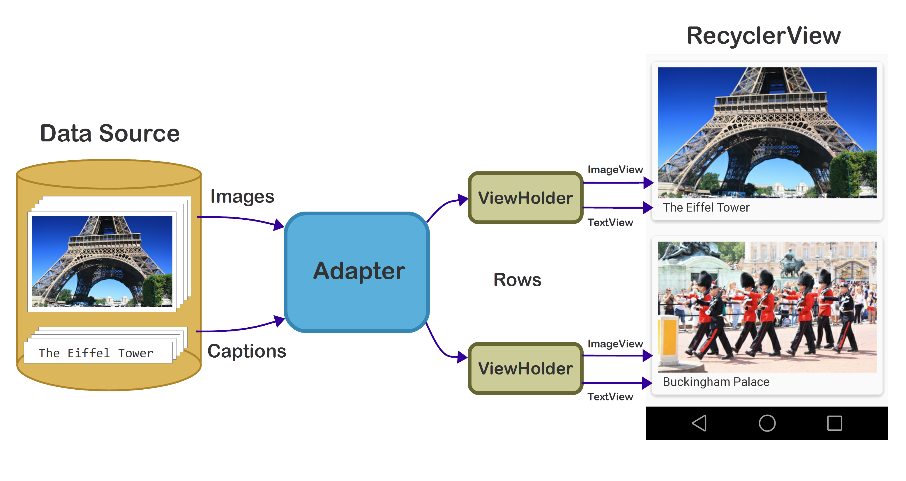
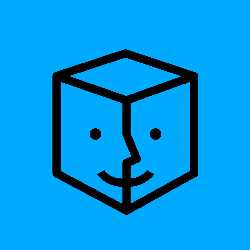

# Présentation du stage pour l'obtention du titre de Développeur Logiciel / Web
## Quentin DEBOVE
### CEFIM, Session 2016-2017

---

# Au programme 
### I. Introduction
### II. Environnement de travail
### III. Android
### IV. Premier projet : Energetics
### V. Second projet : refactorisation d'Aintro
### VI. Conclusion
### VII. Questions ?

---

# I. Introduction

### Milieu paramédical : réorientation
### Ambiance unique

---

# II. Environnement de travail

+++

## Le mame


+++

##NOWLY

+++

|Manysinn Thin                                                                                                                       |Jérome Heissler                                                                        |Mathieu Bolard                                                                          |
|------------------------------------------------------------------------------------------------------------------------------------|---------------------------------------------------------------------------------------|----------------------------------------------------------------------------------------|
|||| 

+++

## Les projets / prestations de NOWLY

+++

### Projets :
|                        |                                   |
|------------------------|-----------------------------------|
|Nowly                   | "papa" d'Aintro                   |
|Aintro                  ||
|et d'autres             | Files, Senseï...                  |

+++

### Prestation :

| Satable | |
|---------|-----------------------------------------------------------------------------------------------------|

+++?image=https://upload.wikimedia.org/wikipedia/commons/thumb/9/93/Fibonacci_spiral_34.svg/2000px-Fibonacci_spiral_34.svg.png

## Les outils de travail

* Bitbucket
* Jira + suite Fibonnaci
* Slack

---

# III. Apprentissage d'Android

+++

## Présentation d'Android

* Système exploitation mobile basé sur noyau Linux.
* Développé par Google, lancé en 2007.
* 80% parts de marché dans le monde.

+++

## Versionning

* Noms de desserts et progression alphabétique


+++

## Java et Android

* V4.4 et inférieur : Dalvik
* Au delà : ART (Android RunTime)

+++

## Création d'un projet

* Deux fichiers importants : Gradle et Manifest
* Version de l'API importante !

+++


 
+++

## Vue, activité et fragment

+++

### Vue



+++

### Activité

* Activité ~ une page et extends du Context.


+++

### Fragment


+++

## La principale difficulté rencontrée

### Cycle de vie 

|Activité                                                                                                                                |Fragment                                                                                                                                |
|----------------------------------------------------------------------------------------------------------------------------------------|----------------------------------------------------------------------------------------------------------------------------------------|
|||

---

# IV. Premier projet : Energetics


+++

## Présentation

* Marque exclusive Intersport.
* Souhaite une application tampon "vitrine".

+++

## Apercu charte graphique (non validée)

+++



+++

## Les grandes lignes du code

* Une classe Article.
* Création de 2 RecycleView.
* Un Singleton.

+++

### La classe Article

* Facilité d'accès aux informations.
* Impléments Serializable.
* CharSequence

+++

### Les RecycleView

|    |RecycleView                                       |ListView                                                          |
|----|--------------------------------------------------|------------------------------------------------------------------|
|Pro |ViewHolder, Animation, Performances, LayoutManager|Mise en place, petite liste, données simples (un seul TextView...)|
|Cons|API min 7, plus compliquée à mettre en place      |Mauvaise avec les collections, pas d'animations personnalisées    |

+++



+++

### Le singleton

TODO

+++

## Les bonus

* Librairie Picasso
```java
Picasso.with(context).load("http://i.imgur.com/DvpvklR.png").into(imageView);
```
* L'effet de parallaxe : SensorManager.
* Bounce sur RecycleView.

+++

## Conclusion du projet

* Intégration difficile.
* Problème de mémoire.
* UX important.

---

# V.Second projet : Réfactorisation d'Aintro


+++

## Présentation

* Expérience reposant sur géoloc.
* Matching prédictif.
* Connection par Twitter et récemment Linkedin.
* Problèmes majeurs : transition entre écrans pas fluide + une activité lancée à chaque nouvelle page

+++

## Les bibliothèques utilisées

* ButterKnife
```'*.java'
@OnClick(R.id.submit)
public void submit(View view) {
  // TODO submit data to server...
}
```
* Retrofit
```'*.java'
public interface GitHubService {
  @GET("users/{user}/repos")
  Call<List<Repo>> listRepos(@Path("user") String user);
}
```
* Dagger 2

+++

## Exemple d'utilisation de fragments

```'*.java'
InvitationFragment invitationFragment = new InvitationFragment();
getActivity().getSupportFragmentManager()
        .beginTransaction()
        .setCustomAnimations(R.anim.anim_in_left, R.anim.anim_out_right, R.anim.anim_in_right, R.anim.anim_out_left)
        .replace(R.id.nearby_activity_fragment, invitationFragment, "invitationFragment")
        .addToBackStack(null)
        .commit();
```

+++

## Conclusion du projet

* Lecture du code / compréhension
* Manque de commentaire
* Dagger 2

---?image=https://raw.githubusercontent.com/qdebove/oral_stage/master/assets/images/android_vs_apple.jpg

# <p style="color: white">VI. Conclusion</p>

* <p style="color: white">Un vrai plaisir de voir ses applications !</p>
* <p style="color: white">Plein de personnes / métiers différents.</p>
* <p style="color: white">Développement personnel d'une petite application de récupération de playlist youtube.</p>

---

# VII. Des questions ?

